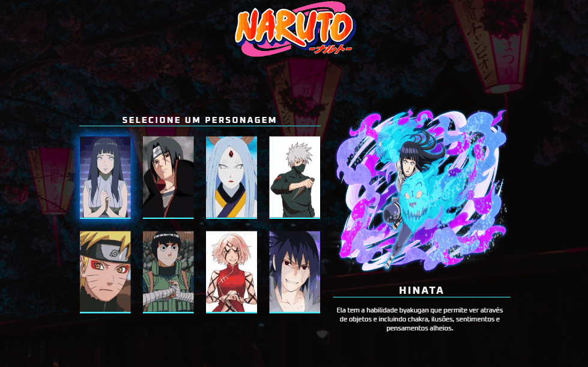
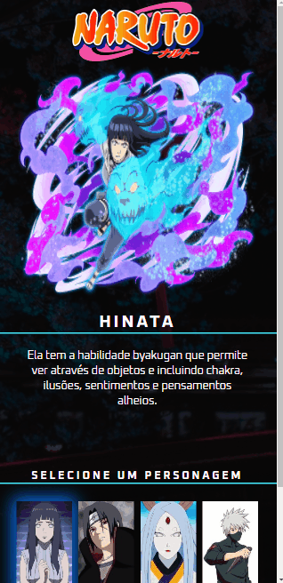

# Projeto Naruto

## Descrição
Projeto realizado durante a Semana Do Zero Ao Programador Contratado, evento realizado pelos DevEmDobro. Porém, com alteração do tema x-men para Naruto. 

## Objetivos
- Cards com as imagens de alguns personagens de Naruto.
- Com o objetivo de apresentar as informações de cada personagem quando passar o mouse por cima dos cards. 

## Desktop Preview

### Mobile Preview

## Tecnologias
- HTML
- CSS
- JS 